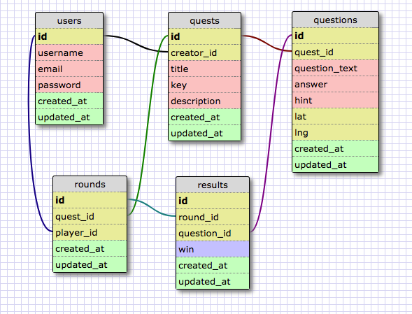

# QuestionAmble

Get description from Wan

### Table of Contents
* [Team Members](###team-members)
* [Structure](###structure)
* [Resources](###resources)
* [Additional Information](###additional-information)

### Team Members
* [Wan Tsui](https://github.com/wantsui)
* [Kelsey Malone](https://github.com/kqm001)
* [Kevin Cross](https://github.com/Kevinhcross96)
* [Rahat Alam](https://github.com/rahat64)

### Structure
The backend of QuestionAmble is built as an Ruby on Rails API calling on data stored in a PostgreSQL database hosted on Heroku.  Our API returns data in JSON format.

#### Database

*Figure 1*.  Simplified schema design for QuestionAmble database.

#### API Endpoint Reference
